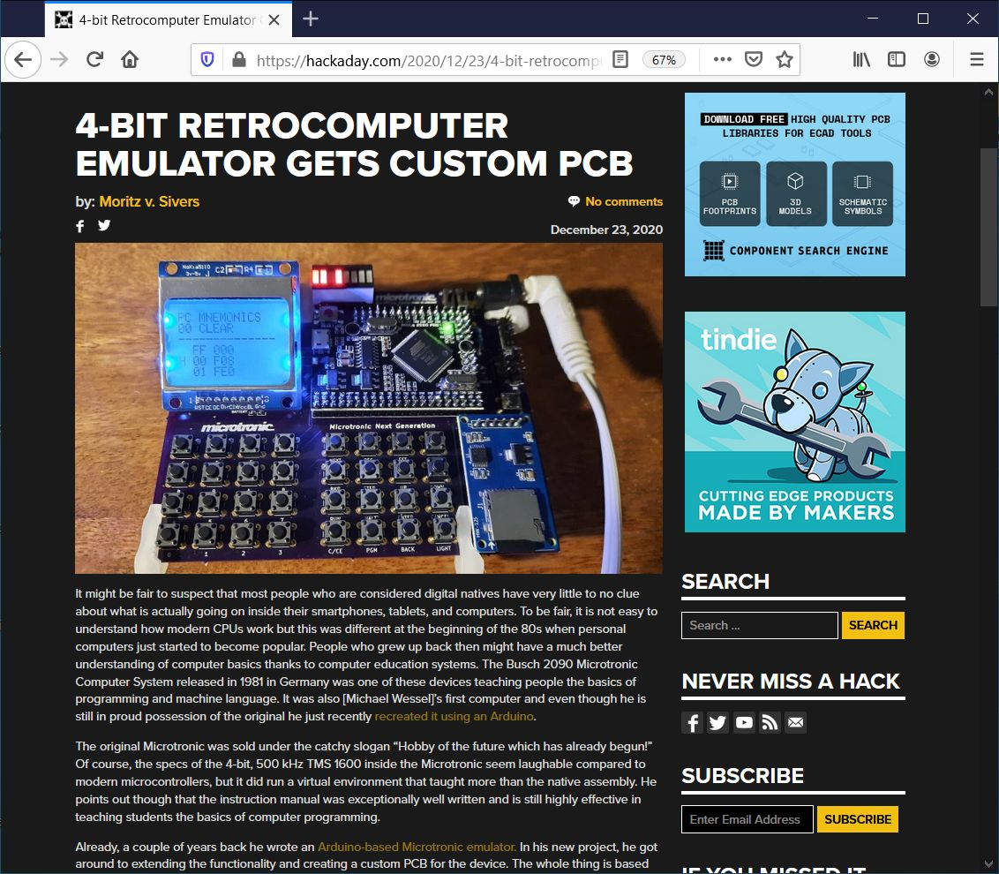
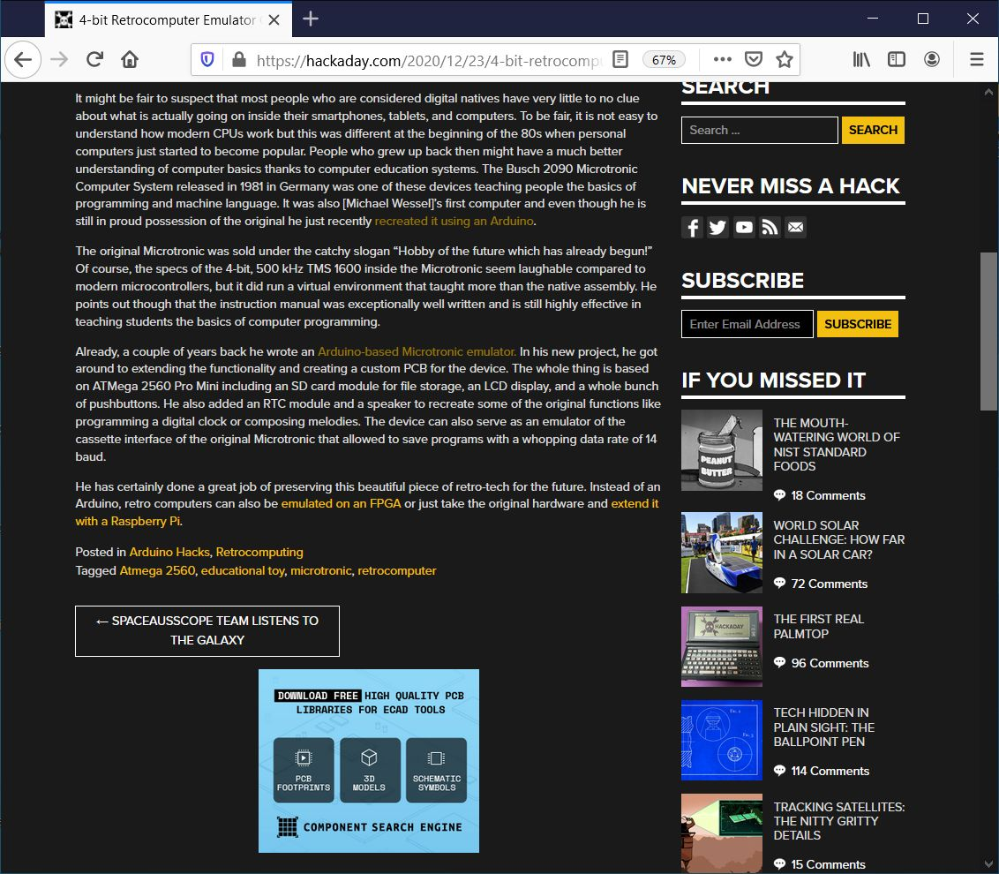
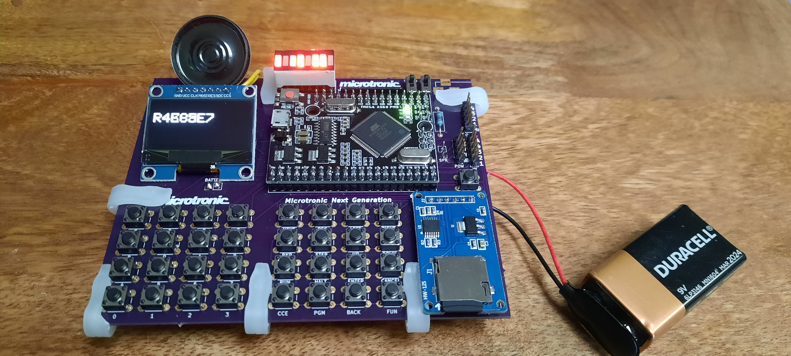
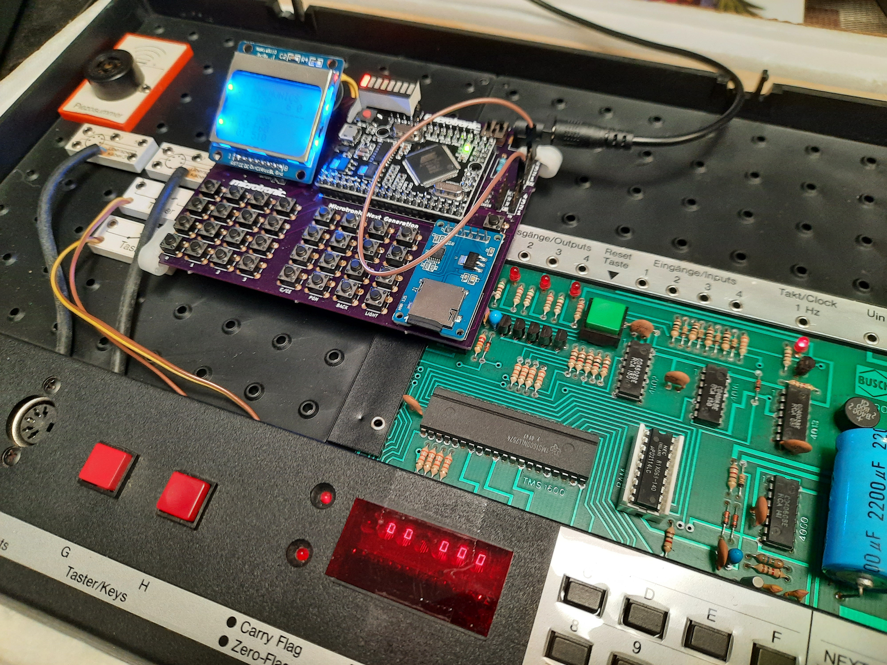
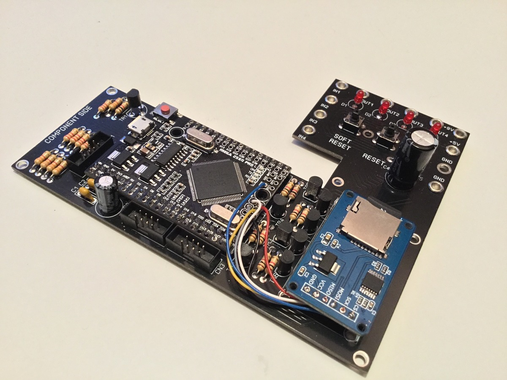

# Arduino-Based Busch 2090 Microtronic Emulators 
## Arduino-based Emulators of the Vintage Busch 2090 Microtronic Computer System from 1981 
#### Authors: 
- [Michael Wessel](http://www.michael-wessel.info/): Original Emulator & Next Generation Emulator 
- Frank de Jaeger: 2nd Generation Microtronic PCB 
- Manfred Henf: 2nd Generation Microtronic 3D Design & Printing 
#### License: GPL 3
#### [YouTube Videos](https://www.youtube.com/playlist?list=PLvdXKcHrGqhekyx81EoCwQij1Lqylp0dB) 

## Abstract

This repository contains a number of Arduino-based emulator of the 
Busch 2090 Microtronic Computer System. 

The latest PCB version - "The Microtronic Next Generation" - also povides
an emulation of the Busch 2095 Cassette Interface that plugs into
a real Microtronic to provide SD-card based file storage. 

Recently, the latest iteration of this project, "The Microtronic Next
Generation", was featured on the Hackaday front page:

 
 
 

## History 

The Busch 2090 was an educational 4bit single-board computer system of
the early 1980s, manufactured by the company Busch Modellbau in
Germany. There is [some information about the Busch 2090 Microtronic
available here, including PDFs of the original manuals in
German](https://www.busch-model.info/service/historie-microtronic/)

The designer of the original Busch Microtronic, Mr. Jörg Vallen of Busch, 
was also so kind to grant permission to include a full copy of the
manual set in the [`manuals`](./manuals/) directory of this project. 

## Emulator Versions 

### Current 2020 Version - The "Microtronic Next Generation" Project 

The current version of the Microtronic Emulator is called the "Micotronic Next Generation", and it comes as a PCB: 

 

 

 

 

 

 

 

### The "Microtronic 2nd Generation" Sister Project  

The "sister project", created by **Frank de Jaeger from Belgium and Manfred Henf from Germany,** ist called the **"Microtronic 2nd Generation"**. Please consider this great project if you wish to create a more professional Microtronic emulator that neatly and professionally installs into an original Busch electronics console, including a 3D-printed keyboad that mounts onto the console hole raster on the top! 

The project uses the same firmware as the "Microtronic Next Generation" presented here, but has a slightly different pin layout (i.e., requires some slight adjustments to the `hardware.h` pin configuration file). The firmware can be found in the [`microtronic-2nd-generation`](./microtronic-2nd-generation/) folder. The 2nd Generation version uses the Nokia 5110, does not support the real time clock (RTC), and does not have a 1Hz output port. The loudspeaker can be
added between A0 and GND over a 75 Ohm resistor as an "after market"
hack / mod (it wasn't anticipated in the original 2nd Generation design). 

**Thanks to Frank and Manfred for this great piece of engineering.** They also *exactly replicated the input and output transistor-stages of the original Microtronic,* so the 2nd Generation project is electrically maximally compatible with the original. It is hence the best choice for a fully compatible  Microtronic emulator that blends perfectly with the Busch electronics system, and for conducting the plenty electronics experiments described in the original Microtronic Busch manuals. 

More details about this great project can be found on the [homepage of the Microtronic 2nd Generation project.](https://www.rigert.com/ee-forum/viewtopic.php?t=2497). 

*The following pictures are courtesy of Frank de Jaeger:* 

### 2016 Versions - DEPRECATED and NOT RECOMMENDED 

**Please note that these version have note been tested recently (they
are from 2016, and Arduino has changed since then).  I strongly
recommend to use the "Micotronic Next Generation" version given above 
instead.**

Hence, the following info is solely provided to give a historical
account of the project (from 2016): 

## Arduino Sketches & Gerbers 

### Current Versions 

Please check the sub-directories
- [`microtronic-nextgen-nokia`](./microtronic-nextgen-nokia/) for the Nokia 5510 Display version, 
- [`microtronic-nextgen-sh1106-spi`](./microtronic-nextgen-sh1106-spi/) for the SH1106 SPI OLED version, and 
- [`microtronic-2nd-generation`](./microtronic-2nd-generation/) for the Nokia 5110-based Microtronic 2nd Generation project. 

The *SH1106 SPI OLED is the latest version* and we have identified this
display as the best option for the project. The Nokia 5510 is a good
choice too, but it is less reactive and gets blurry with very fast
screen updates. 

The 2nd Generation version does not support the real time clock (RTC),
and does not have a 1Hz output port. Note that the loudspeaker can be
added between A0 and GND over a 75 Ohm resistor (as an "after market"
hack / mod).

The SH1106 I2C SPI OLED was also experimented with; see
[`microtronic-nextgen-sh1106-i2c`](./microtronic-nextgen-sh1106-i2c/).
It is **no longer supported** because it is **significantly slower than
both the Nokia 5110 and the SH1106 SPI OLED.**

Only the
[`microtronic-nextgen-sh1106-spi`](./microtronic-nextgen-sh1106-spi/)
will be continued.  The PCB Gerbers will follow shortly.

### Older 2016 Versions - DEPRECATED and NOT RECOMMENDED

See ``busch2090.ino`` or ``busch2090-mega.ino``, or
``busch2090-mega-v3.ino``sketch for further instructions. 

This project consists of two sketches. The main emulator code is in
``busch2090.ino`` for the Uno, and ``busch2090-mega.ino`` or
``busch2090-mega-v3.ino`` for the Mega 2560. The EEPROM has to be
initialized properly before running the emulator. Please load and run
``PGM-EEPROM.ino`` for the Uno version, and ``PGM-EEPROM-MEGA.ino``
for the Mega version(s) first. The EEPROM is loaded with example
ROM programs to be loaded into the emulator via the ``PGM`` key.

The ``busch2090-mega-v3.ino`` is the Busch Microtronic Mega emulator
version 3.  This version uses different hardware, and it is meant to
be housed in a case. In addition, it supports the Emic 2 TTS Speech
Synthesizer module. The Emic 2 module is optional, as is the SDCard
shield. However, Mega version 1 currently requires the SDCard shield
(will be updated soon).

Also, you will find some programs in the ``software`` directory. See
below for instructions how to use them, and for a brief explanation of
the ``.MIC`` file format.

#### Hardware Requirements

For the Uno version, ``busch2090.ino``: 

- An Arduino Uno R3 
- A TM1638 module with 8 7segment digits, 8 push buttons, and 8 LEDs
- A 4x4 keypad with matrix encoding for hexadecimal input 

For the Mega 2560 version, ``busch2090-mega.ino``, you will need 

- An Arduino Mega 2560 R3 
- A TM1638 module with 8 7segment digits, 8 push buttons, and 8 LEDs
- A 4x4 keypad with matrix encoding for hexadecimal input 
- An LCD+Keypad shield
- An optional Ethernet+SDCard shield  

For the Mega 2560 version 3, ``busch2090-mega-v3.ino``, which is meant
to be housed in a case, you will need 

- An Arduino Mega 2560 R3 
- A 4x4 keypad with matrix encoding for hexadecimal input 
- A 3x4 telephone keypad, for function buttons and DIN input, NOT matrix encoded 
- 8 LEDs and matching resistors (for 5 V) 
- 4 pull-down resistors for DIN digital inputs (typical 10 kOhms)
- 4 standard signal diodes for DOT digital outputs to prevent leakage currents from external electronic circuits / experiments connected to the outputs   
- 8 N.O. momentary push buttons
- A power switch
- 2 Adafruit 7Segment LED backpacks 
- 2 potentiometer, one for LCD contrast (100 Ohms), one for CPU speed (200 Ohms)
- A 4x20 LCD display, standard Hitachi HD44780 
- A laser-cut (or laser-printed?) face place. The blueprint / layout is in the ``faceplate`` directory of this project.

The following components are optional for the Mega version 3: 
- Ethernet+SDCard shield (see ``#define SDCARD``) 
- Emic 2 TTS Speech Synthesizer module (see ``#define SPEECH``) 

Please refer to this image for an explanations of the layout and functionality of the front panel: 

#### Wiring 

For the Uno version:

    TM1638 module(14, 15, 16);

    byte colPins[COLS] = {5, 6, 7, 8};
    byte rowPins[ROWS] = {9, 10, 11, 12}; 
    
    #define DIN_PIN_1 1
    #define DIN_PIN_2 2
    #define DIN_PIN_3 3
    #define DIN_PIN_4 4

    #define RESET_PIN 0

    #define CPU_THROTTLE_ANALOG_PIN 5 // connect a potentiometer here for CPU speed throttle control
    #define CPU_THROTTLE_DIVISOR 10 // potentiometer dependent 
    #define CPU_MIN_THRESHOLD 10 // if smaller than this, delay = 0
    
For the Mega 2560 version 1: 
    
    LiquidCrystal lcd(8, 9, 4, 5, 6, 7);

    TM1638 module(49, 47, 45);

    byte rowPins[ROWS] = {37, 35, 33, 31}; 
    byte colPins[COLS] = {36, 34, 32, 30}; 

    #define DIN_PIN_1 22 // digital input pins read by DIN instruction 
    #define DIN_PIN_2 24
    #define DIN_PIN_3 26
    #define DIN_PIN_4 28

    #define RESET_PIN 53

    #define CPU_THROTTLE_ANALOG_PIN 15 // connect a potentiometer here for CPU speed throttle control
    #define CPU_THROTTLE_DIVISOR 10 // potentiometer dependent 
    #define CPU_MIN_THRESHOLD 10 // if smaller than this, delay = 0

    // these are analog values read from the LCD+Keypad shield, adjust if necessary 
    // the read analog values must be greater than these, they are lower bounds: 
    #define NOTHING_KEY 1000
    #define SELECT_KEY  770
    #define LEFT_KEY    540
    #define DOWN_KEY    360
    #define UP_KEY      160

For the Mega version 1, please note that you will have to clip or
disconnect PIN 10 from the LCD+Keypad, otherwise the SDCard will not
function properly. I am using extension headers for this (just bent
PIN 10 out of the way such it doesn't make contact). See this image: 

For the Mega 2560 version 3 - there is more freedom how to set up the hardware, but I did it as follows: 

     // 
     // optional components
     //

     #define SPEECH // comment out if no Emic 2 present
     #define SDCARD // comment out if no SDCard shield present 

     //
     // SDCard chip select pin 4 
     // 

     #if defined (SDCARD)
       #define SDCARD_CHIP_SELECT 4
     #endif
     
     //
     // serial interface Emic 2 TTS module
     //

     #if defined (SPEECH)
        #define RX_SPEECH A8
        #define TX_SPEECH 53
     #endif
     
     //
     //   
     //

     #define RESET  47 // soft reset 

     #define BACK   63
     #define RIGHT  64
     #define UP     65
     #define DOWN   66
     #define LEFT   67
     #define CANCEL 68
     #define ENTER  69

     //
     // status LEDs
     //

     #define DOT_LED_1 55
     #define DOT_LED_2 56
     #define DOT_LED_3 57
     #define DOT_LED_4 58

     #define CLOCK_LED     39
     #define CLOCK_1HZ_LED 41
     #define CARRY_LED     43
     #define ZERO_LED      45

     //
     // 1 Hz clock digital output
     // 

     #define CLOCK_OUT 6

     //
     // DOT digital output
     //

     #define DOT_1 5
     #define DOT_2 3
     #define DOT_3 2  // we need pin 4 for SD card!
     #define DOT_4 18 // PIN 1 didn't work for hardware experiments, probably serial 

     //
     // DIN digital input
     //

     #define DIN_1 17
     #define DIN_2 16
     #define DIN_3 15
     #define DIN_4 14

     //
     // telephone keypad buttons for DIN input
     //

     #define DIN_BUTTON_1 42 // telephone keypad # 
     #define DIN_BUTTON_2 44 // telephone keypad 9 
     #define DIN_BUTTON_3 46 // telephone keypad 6
     #define DIN_BUTTON_4 48 // telephone keypad 3 

     //
     // remaining telephone keypad buttons
     //

     #define CCE  26 // telephone keypad *
     #define RUN  28 // telephone keypad 7
     #define BKP  30 // telephone keypad 4
     #define NEXT 32 // telephone keypad 1
     #define PGM  34 // telephone keypad 0 
     #define HALT 36 // telephone keypad 8 
     #define STEP 38 // telephone keypad 5
     #define REG  40 // telephone keypad 2 

     //
     // CPU speed throttle potentiometer
     //

     #define CPU_THROTTLE_ANALOG_PIN A0
     #define CPU_THROTTLE_DIVISOR 10   // potentiometer dependent 
     #define CPU_MIN_THRESHOLD 5       // if smaller than this, CPU = max speed  
     #define CPU_MAX_THRESHOLD 99      // if higher than this, CPU = min speed 
     #define CPU_DELTA_DISP 3          // if analog value changes more than this, update CPU delay display 

     //
     // for initialization of random generator
     //

     #define RANDOM_ANALOG_PIN A5

     //
     // LCD panel pins
     //

     LiquidCrystal lcd(13, 12, 11, 7, 9, 8); // we need pin 10 for SD card!

     //
     // 2 Adafruit 7Segment LED backpacks
     //

     Adafruit_7segment right = Adafruit_7segment(); // at address 0x71
     Adafruit_7segment left  = Adafruit_7segment(); // at address 0x70 

     // right.begin(0x71);
     //  left.begin(0x70);

     //
     // HEX 4x4 matrix keypad
     //

     #define ROWS 4
     #define COLS 4

     char keys[ROWS][COLS] = { // plus one because 0 = no key pressed!
     {0xD, 0xE, 0xF, 0x10},
     {0x9, 0xA, 0xB, 0xC},
     {0x5, 0x6, 0x7, 0x8},
     {0x1, 0x2, 0x3, 0x4}
     };

     byte colPins[COLS] = {37, 35, 33, 31}; // columns
     byte rowPins[ROWS] = {29, 27, 25, 23}; // rows

     Keypad keypad = Keypad( makeKeymap(keys), rowPins, colPins, ROWS, COLS );

This picture might provide some ideas how to set up / wire the hardware: 

Also notice that there is a blueprint of the faceplate in the 
``faceplate`` directory of this project. 

#### Description 

For the Arduino Uno and Mega version 1, the TM1638 module is used.
The **push buttons of the TM1638 are the function keys of the
Microtronic**, in this order of sequence, from left to right: ``HALT,
NEXT, RUN, CCE, REG, STEP, BKP, RUN``:

    #define HALT  1 
    #define NEXT  2 
    #define RUN   4
    #define CCE   8
    #define REG  16
    #define STEP 32
    #define BKP  64
    #define PGM 128 

The 4x4 keypad keys are hex from `0` to `F`, in bottom-left to
top-right order. You might consider to relabel the keys on the pad 
(I haven't done that):

    7 8 9 A       C D E F 
    4 5 6 B  ==>  8 9 A B
    1 2 3 C  ==>  4 5 6 7
    * 0 # D       0 1 2 3

For the Arduino Mega version 3, there is another (non-matrix encoded)
telephone keypad being used, for function buttons. The mapping
is as follows: 

    1 2 3       NEXT  REG DIN4
    4 5 6  ==>   BKP STEP DIN3
    7 8 9  ==>   RUN HALT DIN2
    * 0 #       C/CE  PGM DIN1

 Microtronic's **Carry** and **Zero** flag are the LEDs 1 and 2 of the
TM1638, the 1 **Hz clock LED** is LED 3 (from left to right). The LEDs
5 to 8 are used as **DOT outputs** (set by the data out op-code
``FEx``). On the Mega version 3, there is no TM1638, but discrete LEDs
are used instead. See below.

Notice that the Arduino reset button will erase the emulator's program
memory. To only reset emulator while keeping the program in memory,
connect Arduino pin ``D0 (RX)`` to ground (or ``D53`` for the Mega
version 1, or ``D47`` for the Mega version 3, which also has N.O.
push button for that purpose).

The Arduino Uno pins ``D1`` to ``D4`` (or ``D22``, ``D24``, ``D24``
and ``D26`` on the Arduino Mega version 1, or the telephone keypad
keys ``#``, ``9``, ``6``, ``3`` and pins ``D14`` to ``D17`` on the
Mega version 3), are read by the Microtronic data in op-code ``FDx
(DIN)``. Connecting them to ground will set the corresponding bit to
1. See ``PGM D``. On the Mega version 3, different pins are used, see
below.

Analog pin ``A5`` on the Uno (or ``A15`` on the Mega version 1, or
``A0`` on the Mega version 3), is used as a CPU speed
throttle. Connect a potentiometer to adjust the speed of the CPU.

Unlike the original Microtronic, this emulator uses the leftmost digit
of the 8digit FM1638 (or of the left Adafruit LEDs backpack display on
the Mega version 3) to display the **current system status** (the
original Microtronic only featured a 6digit display). Currently, the
**status codes** are:

- ``H``: stopped 
- ``A``: enter address 
- ``P``: enter op-code 
- ``r``: running program
- ``?``: keypad input from user requested  
- ``i``: entering / inspecting register via ``REG``  
- ``t`` : entering clock time (``PGM 3``) 
- ``C`` : showing clock time (``PGM 4``) 

Also unlike the original Microtronic, the emulator uses blinking
digits to indicate cursor position. The ``CCE`` key works a little bit
differently, but editing should be comfortable enough.

Typical operation sequences such as ``HALT-NEXT-00-RUN`` and
``HALT-NEXT-00-F10-NEXT-510-NEXT-C00-NEXT`` etc. will work as expected.
Also, try to load a demo program: ``HALT-PGM-7-RUN``. 

On the Mega Version 3.2., also the single step execution and
breakpoint functionalities are also implemented (function keys
``STEP`` and ``BKP``). These functions are not yet implemented on the
older Mega Version 1 and Uno version (I still have to sync back some
changes from Mega Version 3 to these older code bases).

Note that programs can be entered manually, using the keypad and
function keys, or you can load a fixed ROM program specified in the
Arduino sketch via the ``PGM`` button. These ROM programs are defined
in the ``busch2090.ino`` sketch as ``PGM7`` to ``PGMD`` macros. 

The Mega version 1 uses the select button (either the LCD+Keypad
shield for Uno version and Mega version 1, or the discrete N.O. button
with the Mega version 3) to toggle between PC + current op-code
display, register display, extra-register display, and display
off. Notice that the emulator slows down considerably with LCD being
turned on.

For the Mega version 3, I have used a telephone keypad for the function buttons:

    #define CCE  26 // telephone keypad *
    #define RUN  28 // telephone keypad 7
    #define BKP  30 // telephone keypad 4
    #define NEXT 32 // telephone keypad 1
    #define PGM  34 // telephone keypad 0 
    #define HALT 36 // telephone keypad 8 
    #define STEP 38 // telephone keypad 5
    #define REG  40 // telephone keypad 2 

The remaining 4 buttons can be used to provide digital input to
``DIN`` command; in addition, there are also real digital inputs
reserved for hardware experiments:

    #define DIN_BUTTON_1 42 // telephone keypad # 
    #define DIN_BUTTON_2 44 // telephone keypad 9 
    #define DIN_BUTTON_3 46 // telephone keypad 6
    #define DIN_BUTTON_4 48 // telephone keypad 3 

    #define DIN_1 17
    #define DIN_2 16
    #define DIN_3 15
    #define DIN_4 14

Note that on the Mega version 3, all digital inputs are set to
``INPUT_PULLUP``, with *the exception* of these ``DIN_1`` to
``DIN_4``, for which external pull-down resistors have to be used:
  
    pinMode(DIN_1, INPUT); 
    pinMode(DIN_2, INPUT);
    pinMode(DIN_3, INPUT);
    pinMode(DIN_4, INPUT);

The ``DOT`` output LEDs are discrete LEDs, and so are carry and zero
flags, 1 Hz clock, and CPU clock:

    #define DOT_LED_1 55
    #define DOT_LED_2 56
    #define DOT_LED_3 57
    #define DOT_LED_4 58

    #define CLOCK_LED     39
    #define CLOCK_1HZ_LED 41
    #define CARRY_LED     43
    #define ZERO_LED      45

For hardware experiments, there are additional outputs for ``DOT`` as
well:

    #define DOT_1 5
    #define DOT_2 3
    #define DOT_3 2  // we need pin 4 for SD card!
    #define DOT_4 18 // PIN 1 didn't work for hardware experiments, probably serial 

and there is an additional output for clock 1 Hz: 

    #define CLOCK_OUT 6

The faceplate has four holes under the ``DOT`` LEDs for one pair of
``DIN``-``DOT`` input-output cables, and three more holes to the
right, for 9 V VCC, GND, and 1 Hz clock cables.

Since there is no LCD+Keypad shield being used, there are discrete
N.O. buttons that take on these functions (SD card):

    #define BACK   63
    #define RIGHT  64
    #define UP     65
    #define DOWN   66
    #define LEFT   67
    #define CANCEL 68
    #define ENTER  69

#### Load and Save Files to SDCard (Mega versions only) 

The Mega version supports saving a memory dump to SDCard via ``PGM
2``. Currently, the SDCard+Ethernet card shield is mandatory in Mega
version 1, but optional in Mega version 3. The LCD+Keypad shield
offers a primitive file name editor. Use ``Select`` key to confirm
current file name; ``Left`` and ``Right`` keys to move cursor, ``Up``
and ``Down`` keys to change character at cursor position.

With the Mega version 3, there is no keypad, but discrete N.O. buttons
(see above) take on the functions for SD card operations.

Files are loaded from SDCard via ``PGM 1``. Here, the LCD+Keypad
shield is used to browse through the directory of files. Use ``Select``
key to confirm selection, and ``Left`` key to abort loading.

#### The ``.MIC`` File Format and Example Programs 

The ``software`` directory contains some programs from the
Microtronic manuals and from the book "Computer Games (2094)". With
the Mega version, you can put these files on a FAT16 formatted SDCard,
and load them via ``PGM1``. Please refer to the original manuals on
how to use these programs.

In ``.MIC`` file, in addition to hexadecimal instructions, you can
find comments (a line starting with ``#``), as well as the origin
address instruction ``@ xx``. This means that the instructions
following ``@ xx`` will be stored from address ``xx`` on. Most of the
time, you will find ``@ 00`` at the beginning of the file. If a
``.MIC`` file does not contain a ``@ xx``, then the program will be
loaded at the current PC. That way, programs could be relocatable
(e.g., for subroutines). Also, a ``.MIC`` can contain more than one ``@
xx``. An example is the ``DAYS.MIC`` program. 

There are a couple of programs in the Microtronic Manual Vol. 2 which
require incremental loading of parts, i.e., first load ``DAYS.MIC``,
and then additionally load ``WEEKDAY.MIC``. The programs automatically
load at the correct addresses.

The example programs in the ``software`` directory have been
automatically converted from the above linked PDFs with the help of an
OCR (Optical Character Recognition) program, so they may contain some
strange characters and OCR artifacts and errors. Not all programs have
been tested by the author yet. Programs which have been successfully
tested contain a ``# tested`` comment.  To compensate for OCR
artifacts, the ``.MIC`` loader recognizes an extended character set
for hexadecimal input, e.g., not only 1, but also I and l are accepted
for 1, the O character is accepted for 0, etc.

#### ``PGM`` Demo Programs are Stored in EEPROM  

For the Uno version, please run the ``PGM-EEPROM.ino`` sketch first,
and use ``PGM-EEPROM-MEGA.ino`` for the Mega versions. This will load
example programs into the Arduino's EEPROM. The emulator won't
initialize correctly otherwise. 

The programs stored into and loaded from the EEPROM are ``PGM 7`` to
``PGM C``:

- ``PGM 0`` : self-test not yet implemented. 
- ``PGM 1`` : on Mega, this loads a program memory dump from SDCard. Use LCD+Keypad shield to select file via ``Select`` key, ``Left`` key to abort loading. 
- ``PGM 2`` : on Mega, this saves a complete memory dump to SDCard (``.MIC`` file extension is used). The LCD+Keypad shield offers a simple filename editor. Use ``Left`` and ``Right`` to change cursor position, ``Up`` and ``Down`` to change character at cursor position, and ``Select`` to confirm and save. The files are stored as text. You can also use a simple text editor to create files (CR+LF end of line coding), and load them back via ``PGM 2``. Whitespace is ignored. 
- ``PGM 3`` : set time / clock (not a real program, i.e., nothing is loaded into program memory for this function) 
- ``PGM 4`` : show time / clock  (not a real program, i.e., nothing is loaded into program memory for this function) 
- ``PGM 5`` : clear memory
- ``PGM 6`` : load ``F01`` (NOPs) into memory
- ``PGM 7`` : the Nim game as documented in the Microtronic Manual Vol. 1, page 7. Many thanks to Martin Sauter for
retrieving the code from an original Busch Microtronic and contributing it to this project! 
- ``PGM 8`` : crazy counter
- ``PGM 9`` : the electronic die, from Microtronic Manual Vol. 1, page 10
- ``PGM A`` : the three digit counter from Microtronic Manual Vol. 1, page 19 
- ``PGM B`` : moving LED light from Manul Vol. 1, page 48 
- ``PGM C`` : digitial input ``DIN`` test (port input output echo)

#### Optional Emic 2 TTS Speech Module for Mega Version 3 

If enabled, the Emic 2 speech module will echo back and confirm
function and HEX keypad presses. In addition, the navigation buttons
of the file browser trigger the following functions:

- Left : describe current system status.
- Right :  describe content of 7segment display 
- Up : general Microtronic emulator information 
- Down : emulator software version
- Cancel : get an answer from the Magic 8-Ball 
- Back: listen to HAL 9000 

Also, activities such as loading a PGM or SDCard program, clearing the
program memory, displaying or setting the time, are spoken.

Occasionally, the Emic 2 crashes and simply stops talking. Then, only a
full power-cycle will revive it.

The built-in Emic can also be accessed programmatically be means of
Microtronic machine instructions, and hence be made to speak arbitrary
sentences. The ``MOV xx`` / code ``0xx`` instructions are being used
for this purpose. The effect of a ``MOV xx`` instruction is to copy
the contents of register ``x`` onto itself, so these instructions are
basically vacuous, redundant NO-OPs. An extra meaning / extra effect
is given to them in the Mega version 3. Here, a ``MOV xx`` sends a
(high- or low) nibble ``x`` to the built-in Emic 2.  A full ASCII
character with decimal code ``xy`` (e.g., 65 for character ``A``) is
thus sent via ``0xx, 0yy`` (e.g., ``066, 055`` for character ``A``),
in "most significant nibble first" order. Notice that these nibbles
are decimal nibbles though, not hexadecimal nibbles. Hence, ``x`` can
take values from 0 to C (ASCII goes from 0 to 127, and 12 = C - not
all ASCII characters are speakable, of course - in fact, all
characters below 32 are ignored, with the exception of carriage
return, ASCII code 13).  Decimal coding is used in order to make entry
of ASCII character codes more convenient. Notice that Emic requires a
heading ``S`` as well as a trailing carriage return (ASCII code 13).
An ``ABC`` from the Emic 2 hence takes the program ``088 033 066 055
066 066 066 077 011 0033``.  Consequently, the Microtronic program
memory can store 126 characters max.

#### Required Third-Party Libraries 

The emulator requires the following libraries, which are the work of
others, and which are included in the ``library`` subdirectory: 

- ``Keypad`` library
- ``TM1638`` library - note that this is a modified version of the original one 
- ``TM16XXFonts`` for alphanumeric 7segment display fonts
- ``EEPROM`` library 

For the Mega version 1, the following standard libraries are used, and
already part of the Arduino distribution (version 1.6.6):

- ``TM16XXFonts`` from the ``TM1638`` library 
- ``LiquidCrystal`` library
- ``SPI`` library
- ``SD`` library
- ``String`` library

The ``SD`` and ``String`` libraries were responsible for memory leaks 
and terrible system instability. I hence removed them in Mega version 3, 
and switched to the fabulous ``SdFat`` library which works much more
reliably. 

For the Mega version 3, the following standard libraries are used, and
already part of the Arduino distribution (version 1.6.6):

- ``TM16XXFonts`` from the ``TM1638`` library 
- ``LiquidCrystal`` library
- ``SPI`` library
- ``SoftwareSerial`` to talk to the Emic 2 TTS module 

These additional Adafruit libraries are required to drive the 
7Segment LED SPI backpack displays. They are available from the Adafruit homepage:  

- ``Adafruit_LEDBackpack``library
- ``Adafruit_GFX`` library

In addition, instead of the ``SD`` card library, the 

- ``SdFat`` library. 

#### Future Work 

1. Sync back latest changes from Mega version 3 into Mega version 1 and
Uno version.

